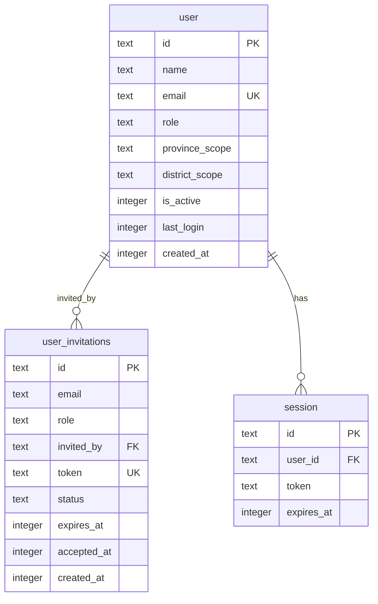

# feat: Super-Admin User Management with Email Invitations

## Overview

Enable super-admins to manage users in the RDA Status system through:
1. **Invite users via email** with pre-assigned roles
2. **View all users** in a searchable, sortable table
3. **Update user roles** with immediate effect

This feature uses Better Auth's admin plugin for user management APIs and a custom invitation system built on the existing Mailgun integration.

## Problem Statement

Currently, users can only self-register via magic link (defaulting to "citizen" role). There's no way for administrators to:
- Onboard official users (field officers, planners, admins) with appropriate roles
- View or manage existing users
- Change user roles after account creation

This creates operational friction and security gaps.

## Technical Approach

### Architecture

```
┌─────────────────────────────────────────────────────────────────────┐
│                        Frontend (React)                              │
│  ┌─────────────────┐  ┌─────────────────┐  ┌─────────────────────┐  │
│  │  AdminUsers.tsx │  │ InviteUserModal │  │  EditRoleModal      │  │
│  │  (user table)   │  │ (send invite)   │  │  (change role)      │  │
│  └────────┬────────┘  └────────┬────────┘  └──────────┬──────────┘  │
└───────────┼─────────────────────┼────────────────────┼──────────────┘
            │                     │                    │
            ▼                     ▼                    ▼
┌─────────────────────────────────────────────────────────────────────┐
│                    API Routes (Hono)                                 │
│  GET /api/v1/admin/users          - List all users                  │
│  POST /api/v1/admin/users/invite  - Send invitation                 │
│  PATCH /api/v1/admin/users/:id    - Update user (role, status)      │
│  GET /api/v1/invitations/:token   - Get invitation details          │
│  POST /api/v1/invitations/:token/accept - Accept invitation         │
└────────────────────────────────────┬────────────────────────────────┘
                                     │
                                     ▼
┌─────────────────────────────────────────────────────────────────────┐
│                    Database (D1 + Drizzle)                          │
│  ┌─────────────┐  ┌──────────────────┐  ┌────────────────────────┐  │
│  │    user     │  │  user_invitations │  │       session         │  │
│  │ (existing)  │  │     (NEW)         │  │     (existing)        │  │
│  └─────────────┘  └──────────────────┘  └────────────────────────┘  │
└─────────────────────────────────────────────────────────────────────┘
```

### Database Schema



## Implementation Phases

### Phase 1: Database & Backend Foundation

#### 1.1 Create user_invitations table

**File:** `src/worker/db/schema.ts`

```typescript
// New invitation table schema
export const userInvitations = sqliteTable("user_invitations", {
  id: text("id").primaryKey(),
  email: text("email").notNull(),
  role: text("role").notNull(),
  invitedBy: text("invited_by").references(() => user.id),
  token: text("token").notNull().unique(),
  status: text("status").notNull().default("pending"), // pending, accepted, expired, cancelled
  expiresAt: integer("expires_at", { mode: "timestamp" }).notNull(),
  acceptedAt: integer("accepted_at", { mode: "timestamp" }),
  createdAt: integer("created_at", { mode: "timestamp" }).default(sql`(unixepoch())`).notNull(),
});
```

**Migration:** `src/worker/db/migrations/0003_add_user_invitations.sql`

```sql
CREATE TABLE user_invitations (
  id TEXT PRIMARY KEY,
  email TEXT NOT NULL,
  role TEXT NOT NULL,
  invited_by TEXT REFERENCES user(id),
  token TEXT NOT NULL UNIQUE,
  status TEXT NOT NULL DEFAULT 'pending',
  expires_at INTEGER NOT NULL,
  accepted_at INTEGER,
  created_at INTEGER DEFAULT (unixepoch()) NOT NULL
);

CREATE INDEX user_invitations_email_idx ON user_invitations(email);
CREATE INDEX user_invitations_token_idx ON user_invitations(token);
CREATE INDEX user_invitations_status_idx ON user_invitations(status);
```

#### 1.2 Admin user routes

**File:** `src/worker/routes/admin.ts`

```typescript
// GET /api/v1/admin/users - List all users (super_admin only)
adminRoutes.get("/users", requireRole("super_admin"), async (c) => {
  const db = createDb(c.env.DB);
  const users = await db.select().from(user).orderBy(desc(user.createdAt));
  return c.json(users);
});

// POST /api/v1/admin/users/invite - Send invitation
adminRoutes.post("/users/invite",
  requireRole("super_admin"),
  zValidator("json", inviteUserSchema),
  async (c) => {
    // 1. Validate email doesn't exist
    // 2. Generate secure token
    // 3. Create invitation record
    // 4. Send email via Mailgun
    // 5. Return success/failure
  }
);

// PATCH /api/v1/admin/users/:id - Update user role/status
adminRoutes.patch("/users/:id",
  requireRole("super_admin"),
  zValidator("json", updateUserSchema),
  async (c) => {
    // 1. Validate user exists
    // 2. Prevent self-role-change
    // 3. Prevent demoting last super_admin
    // 4. Update user
    // 5. Invalidate sessions if role changed
  }
);
```

#### 1.3 Public invitation routes

**File:** `src/worker/routes/invitations.ts` (NEW)

```typescript
// GET /api/v1/invitations/:token - Get invitation details
invitationRoutes.get("/:token", async (c) => {
  // Return invitation info (email, role, expires) for display
});

// POST /api/v1/invitations/:token/accept - Accept invitation
invitationRoutes.post("/:token/accept",
  zValidator("json", acceptInvitationSchema),
  async (c) => {
    // 1. Validate token exists and not expired
    // 2. Create user account with role
    // 3. Mark invitation as accepted
    // 4. Trigger magic link flow
  }
);
```

### Phase 2: Frontend - User Management Page

#### 2.1 AdminUsers page

**File:** `src/react-app/pages/AdminUsers.tsx`

Features:
- TanStack Table for user list
- Columns: Name, Email, Role, Status, Last Login, Created, Actions
- Search by email/name
- Filter by role, status
- Pagination (50 per page)
- "Invite User" button opening modal
- Row actions: Edit Role, Deactivate/Activate

#### 2.2 InviteUserModal component

**File:** `src/react-app/components/admin/InviteUserModal.tsx`

Fields:
- Email (required, validated)
- Role (dropdown: field_officer, planner, admin, super_admin, stakeholder)
- Province Scope (optional)
- District Scope (optional)

#### 2.3 EditUserModal component

**File:** `src/react-app/components/admin/EditUserModal.tsx`

Fields:
- Role (dropdown)
- Province/District Scope
- Active status toggle

### Phase 3: Invitation Acceptance Flow

#### 3.1 AcceptInvitation page

**File:** `src/react-app/pages/AcceptInvitation.tsx`

Flow:
1. Parse token from URL `/invite/:token`
2. Fetch invitation details from API
3. If valid: Show welcome form (name input)
4. If expired: Show "Invitation expired" message
5. If used: Show "Already accepted" with login link
6. On submit: Create account, send magic link

#### 3.2 Email template

**File:** `src/worker/services/emailTemplates.ts` (NEW)

```typescript
export function getInvitationEmailHtml(params: {
  inviterName: string;
  role: string;
  inviteUrl: string;
  expiresAt: Date;
}): string {
  return `
    <div style="...">
      <h1>You've been invited to Sri Lanka Road Status</h1>
      <p>${params.inviterName} has invited you to join as ${params.role}.</p>
      <p>This invitation expires on ${params.expiresAt.toLocaleDateString()}.</p>
      <a href="${params.inviteUrl}" style="...">Accept Invitation</a>
    </div>
  `;
}
```

### Phase 4: Navigation & Polish

#### 4.1 Update sidebar

**File:** `src/react-app/components/app-sidebar.tsx`

```typescript
const adminItems: NavItem[] = [
  {
    title: "Citizen Reports",
    url: "/admin/reports",
    icon: Shield,
    roles: ["admin", "super_admin"],
  },
  {
    title: "User Management",  // NEW
    url: "/admin/users",
    icon: Users,
    roles: ["super_admin"],  // Super-admin only
  },
];
```

#### 4.2 Add route

**File:** `src/react-app/App.tsx`

```typescript
<Route
  path="/admin/users"
  element={
    <ProtectedRoute allowedRoles={["super_admin"]}>
      <AdminUsers />
    </ProtectedRoute>
  }
/>
<Route path="/invite/:token" element={<AcceptInvitation />} />
```

## Acceptance Criteria

### Functional Requirements

- [ ] Super-admin can view list of all users with search/filter/sort
- [ ] Super-admin can invite new users by email with pre-assigned role
- [ ] Invitation emails are sent via Mailgun with clear instructions
- [ ] Invitees can accept invitation within 7 days
- [ ] Accepting invitation creates account with correct role
- [ ] Super-admin can change any user's role (except own)
- [ ] Super-admin can activate/deactivate users
- [ ] Cannot demote the last super-admin
- [ ] Deactivated users cannot log in
- [ ] Role changes take effect on next session refresh

### Non-Functional Requirements

- [ ] User list loads within 500ms for up to 1000 users
- [ ] Email delivery within 30 seconds of invitation
- [ ] Mobile-responsive user management interface
- [ ] Secure token generation (256-bit cryptographic random)

### Edge Cases

- [ ] Inviting existing email shows clear error
- [ ] Expired invitation shows appropriate message with contact info
- [ ] Already-used invitation redirects to login
- [ ] Multiple pending invitations to same email: latest overwrites
- [ ] Super-admin trying to change own role: prevented with message
- [ ] Last super-admin demotion: prevented with message

## Files to Create/Modify

| File | Action | Description |
|------|--------|-------------|
| `src/worker/db/schema.ts` | Modify | Add userInvitations table |
| `src/worker/db/migrations/0003_add_user_invitations.sql` | Create | Migration for invitations |
| `src/worker/routes/admin.ts` | Modify | Add user management endpoints |
| `src/worker/routes/invitations.ts` | Create | Public invitation routes |
| `src/worker/services/emailTemplates.ts` | Create | Email HTML templates |
| `src/worker/index.ts` | Modify | Mount invitation routes |
| `src/react-app/pages/AdminUsers.tsx` | Create | User management page |
| `src/react-app/pages/AcceptInvitation.tsx` | Create | Invitation acceptance page |
| `src/react-app/components/admin/InviteUserModal.tsx` | Create | Invite user form |
| `src/react-app/components/admin/EditUserModal.tsx` | Create | Edit user form |
| `src/react-app/components/app-sidebar.tsx` | Modify | Add User Management link |
| `src/react-app/App.tsx` | Modify | Add routes |
| `src/shared/types.ts` | Modify | Add invitation types |

## Design Decisions

### D1: Invitation expiration = 7 days
**Rationale:** Matches session duration. Long enough for users who don't check email daily, short enough to limit token exposure.

### D2: Separate invitations table (not reusing verification)
**Rationale:** Better-auth manages verification table internally. Separate table avoids conflicts and allows invitation-specific fields (role, invitedBy, status).

### D3: Super-admin only (not admin)
**Rationale:** User management is sensitive. Limiting to super-admin provides clear security boundary. Admins handle reports, super-admins handle users.

### D4: Session invalidation on role change = No (rely on session refresh)
**Rationale:** Immediate invalidation could disrupt legitimate work. Better-auth already refreshes sessions every 24 hours. For urgent revocation, use deactivation.

### D5: Inviting existing email = Error (not role update)
**Rationale:** Clearer UX. If admin wants to change existing user's role, use Edit function directly. Prevents accidental role overwrites.

## Security Considerations

- Invitation tokens: 256-bit cryptographic random (crypto.randomUUID or equivalent)
- Rate limiting: Consider adding 10 invitations/hour per super-admin (not MVP)
- CSRF: Hono handles via session cookies with SameSite
- Audit logging: Not in MVP, recommend for future
- Email enumeration: Invitation endpoint returns same message whether email exists or not

## Testing Plan

1. **Unit Tests**
   - Token generation is cryptographically secure
   - Expiration logic is correct
   - Role validation rejects invalid roles

2. **Integration Tests**
   - Invitation creation stores correct data
   - Email sent via Mailgun mock
   - Invitation acceptance creates user with role
   - Role update modifies user record

3. **E2E Tests**
   - Super-admin invites user → User receives email → User accepts → User can login with role
   - Super-admin changes user role → User sees new permissions after re-login
   - Non-super-admin cannot access user management

## References

### Internal Files
- Auth config: `src/worker/auth/index.ts` (lines 45-161)
- Auth schema: `src/worker/db/auth-schema.ts` (lines 6-104)
- Role types: `src/shared/types.ts` (lines 1-11)
- Admin routes pattern: `src/worker/routes/admin.ts`
- AdminReports pattern: `src/react-app/pages/AdminReports.tsx`
- Sidebar: `src/react-app/components/app-sidebar.tsx` (lines 71-78)

### External Documentation
- [Better Auth Admin Plugin](https://www.better-auth.com/docs/plugins/admin)
- [Mailgun API](https://documentation.mailgun.com/docs/mailgun/api-reference/openapi-final/tag/Messages/)
- [TanStack Table](https://tanstack.com/table/latest)
- [OWASP Session Management](https://cheatsheetseries.owasp.org/cheatsheets/Session_Management_Cheat_Sheet.html)

### Related PRs
- #6 Mobile responsiveness (UI patterns)
