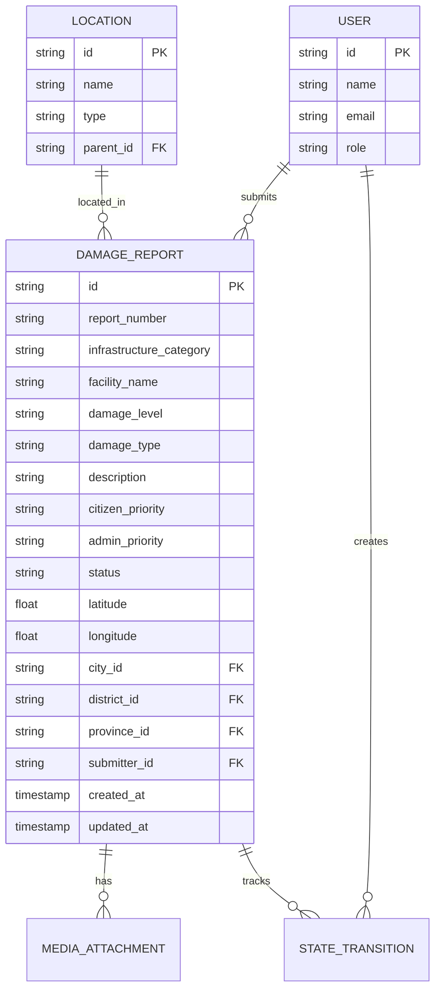

# National Infrastructure Recovery System

## Overview

Transform the existing road blockage tracking system into a **National Infrastructure Recovery** platform for reporting and managing damage to public/government/institutional infrastructure (excluding roads/rail) following natural disasters.

### Key Stakeholders
- **Citizens**: Report damage via mobile-friendly web interface, provide their perceived priority
- **Admins**: Validate reports, set official priority, assign to projects, track resolution

### Scope
- **In Scope**: Government buildings, schools, hospitals, utilities
- **Out of Scope**: Roads, railways, bridges (fresh start - existing road data will be removed)

---

## Problem Statement

Following natural disasters in Sri Lanka, there is no unified system for citizens to report infrastructure damage to public buildings and facilities, or for government officials to efficiently triage and coordinate reconstruction efforts.

---

## Proposed Solution

### Simplified Data Model

#### Infrastructure Categories (4 only)

```typescript
// src/shared/types.ts

export const INFRASTRUCTURE_CATEGORIES = [
  'government_building',
  'school',
  'hospital',
  'utility'
] as const;

export type InfrastructureCategory = typeof INFRASTRUCTURE_CATEGORIES[number];

export const INFRASTRUCTURE_CATEGORY_LABELS: Record<InfrastructureCategory, string> = {
  government_building: 'Government Building',
  school: 'School / Educational',
  hospital: 'Hospital / Healthcare',
  utility: 'Utilities & Services'
};
```

#### Damage Levels (3 citizen-friendly options)

```typescript
export const DAMAGE_LEVELS = [
  'minor',    // Building usable but needs repair
  'major',    // Building unusable, repairable
  'destroyed' // Building collapsed or beyond repair
] as const;

export type DamageLevel = typeof DAMAGE_LEVELS[number];

export const DAMAGE_LEVEL_LABELS: Record<DamageLevel, { label: string; description: string; color: string }> = {
  minor: {
    label: 'Minor Damage',
    description: 'Building is usable but needs repair',
    color: 'yellow'
  },
  major: {
    label: 'Major Damage',
    description: 'Building is unusable but can be repaired',
    color: 'orange'
  },
  destroyed: {
    label: 'Destroyed',
    description: 'Building collapsed or beyond repair',
    color: 'red'
  }
};
```

#### Dual Priority System (Citizen + Admin)

```typescript
export const PRIORITY_LEVELS = ['high', 'medium', 'low'] as const;

export type PriorityLevel = typeof PRIORITY_LEVELS[number];

// Citizens set their perceived priority when submitting
// Admins set official priority during review
```

### Database Schema Changes

#### Simplified Schema (5 new columns, remove road-specific)

```sql
-- Add new infrastructure damage fields
ALTER TABLE damage_reports ADD COLUMN infrastructure_category TEXT
  CHECK (infrastructure_category IN ('government_building', 'school', 'hospital', 'utility'));

ALTER TABLE damage_reports ADD COLUMN facility_name TEXT;

ALTER TABLE damage_reports ADD COLUMN damage_level TEXT
  CHECK (damage_level IN ('minor', 'major', 'destroyed'));

ALTER TABLE damage_reports ADD COLUMN citizen_priority TEXT
  CHECK (citizen_priority IN ('high', 'medium', 'low'));

ALTER TABLE damage_reports ADD COLUMN admin_priority TEXT
  CHECK (admin_priority IN ('high', 'medium', 'low'));

-- Remove road-specific fields (destructive - OK per requirements)
ALTER TABLE damage_reports DROP COLUMN asset_type;
ALTER TABLE damage_reports DROP COLUMN asset_id;
ALTER TABLE damage_reports DROP COLUMN passability_level;
ALTER TABLE damage_reports DROP COLUMN is_single_lane;
ALTER TABLE damage_reports DROP COLUMN blocked_distance_meters;
ALTER TABLE damage_reports DROP COLUMN route_category;

-- Add index for common queries
CREATE INDEX idx_reports_category ON damage_reports(infrastructure_category);
CREATE INDEX idx_reports_damage_level ON damage_reports(damage_level);
CREATE INDEX idx_reports_admin_priority ON damage_reports(admin_priority);
CREATE INDEX idx_reports_status ON damage_reports(status);
```

### Simplified User Roles

```typescript
export const USER_ROLES = {
  citizen: { canSubmit: true, canReview: false },
  admin: { canSubmit: true, canReview: true, canManageAll: true },
  super_admin: { canSubmit: true, canReview: true, canManageAll: true, canManageUsers: true }
} as const;
```

### Simplified Status Workflow

```typescript
export const REPORT_STATUSES = [
  'new',         // Just submitted by citizen
  'verified',    // Admin confirmed as valid report
  'in_progress', // Work has started
  'resolved',    // Repair completed
  'rejected'     // Invalid or duplicate report
] as const;

export type ReportStatus = typeof REPORT_STATUSES[number];

// Simple linear flow: new → verified → in_progress → resolved
//                     new → rejected (invalid reports)
```

```
┌─────────────────────────────────────────────────────────────┐
│                    CITIZEN SUBMISSION                        │
│  Report damage → Photos → Location → Priority → Submit       │
└─────────────────────────────────────────────────────────────┘
                              │
                              ▼
┌─────────────────────────────────────────────────────────────┐
│                    ADMIN REVIEW                              │
│  View report → Verify/Reject → Set admin priority            │
│  Status: new → verified OR rejected                          │
└─────────────────────────────────────────────────────────────┘
                              │
                              ▼
┌─────────────────────────────────────────────────────────────┐
│                    WORK TRACKING                             │
│  Mark in_progress → Mark resolved when complete              │
│  Status: verified → in_progress → resolved                   │
└─────────────────────────────────────────────────────────────┘
```

---

## Technical Approach

### Phase 1: Schema & Types (Week 1)

**Files to modify:**
- `src/shared/types.ts` - Add new types for categories, damage levels, priority
- `src/worker/db/schema.ts` - Modify damageReports table
- Create migration script

**Key changes:**
1. Add 5 new columns (category, facility_name, damage_level, citizen_priority, admin_priority)
2. Remove road-specific columns
3. Add database indexes
4. Update TypeScript types

### Phase 2: Citizen Reporting Flow (Week 2)

**Files to modify:**
- `src/react-app/pages/ReportIncident.tsx` - Replace road UI with building damage UI

**Simplified form flow:**
1. **Step 1: Photos** (keep existing camera component)
2. **Step 2: Location** (province, district, city, coordinates - keep existing)
3. **Step 3: Damage Details**
   - Category: 4 icon buttons (government, school, hospital, utility)
   - Facility name: text input
   - Damage level: 3 visual options with descriptions
   - Description: textarea
   - Your priority: high/medium/low selector
4. **Step 4: Contact** (keep existing)

### Phase 3: Admin Dashboard (Week 3)

**Files to modify:**
- `src/react-app/pages/AdminReports.tsx` - Enhance with new fields and filters

**Single admin interface with:**
- Table view: ID, Facility, Category, Damage Level, Citizen Priority, Admin Priority, Status, Location, Date
- Filters: Status, Category, Damage Level, Admin Priority, Province, District
- Quick actions: Verify, Reject, Set Priority
- Detail drawer: Full report view, status updates, priority assignment, notes

### Phase 4: Public Map & Polish (Week 4)

**Files to modify:**
- `src/react-app/pages/Home.tsx` - Update map for building damage

**Changes:**
- Point markers instead of road segments
- Color by damage level (yellow/orange/red)
- Icon by category (4 icons)
- Filter by category, damage level, province
- Stats bar: total reports, by category, by damage level

---

## Acceptance Criteria

### Functional Requirements

- [ ] Citizens can report damage selecting from 4 infrastructure categories
- [ ] Citizens can assess damage using 3 simple levels (minor/major/destroyed)
- [ ] Citizens can set their perceived priority (high/medium/low)
- [ ] Photos are captured with GPS and associated with reports
- [ ] Admins can verify or reject reports
- [ ] Admins can set official priority separate from citizen priority
- [ ] Admins can update status through the workflow
- [ ] All status changes are logged in audit trail
- [ ] Public map shows verified infrastructure damage reports
- [ ] Citizens can view basic status of their submitted reports

### Non-Functional Requirements

- [ ] Mobile-responsive design for citizen reporting
- [ ] Sub-3 second page load times
- [ ] Role-based access control enforced

### Quality Gates

- [ ] Migration tested on staging before production
- [ ] All new fields have TypeScript types
- [ ] E2E test covers citizen submit → admin verify → resolve flow

---

## API Changes

### Modified Endpoints

```
POST /api/v1/reports
  - Add: infrastructure_category, facility_name, damage_level, citizen_priority
  - Remove: asset_type, passability_level, blocked_distance_meters

PATCH /api/v1/admin/reports/:id
  - Add: admin_priority field
  - Keep: status updates work as before

GET /api/v1/admin/reports
  - Add filters: infrastructure_category, damage_level, admin_priority
```

No new endpoints needed - use existing REST patterns.

---

## Migration Strategy

1. **Backup existing data** (for reference only)
2. **Run destructive migration** - remove road columns, add infrastructure columns
3. **Clear existing reports** (fresh start)
4. **Deploy updated application**
5. **Seed location data** if needed

---

## Risk Analysis

| Risk | Impact | Mitigation |
|------|--------|------------|
| Migration fails | High | Test on staging first, have rollback script |
| Citizens confused by new form | Medium | Clear labels, visual examples for damage levels |
| Admins need training | Low | Simple interface, minimal new concepts |

---

## Future Considerations (Post-MVP)

- Multi-tier workflow (if usage shows need for delegation)
- Cost estimation by admins
- Project linking for grouped repairs
- GN Division level granularity
- Offline photo capture with sync
- SMS-based reporting
- Analytics dashboards

---

## ERD: Simplified Entity Relationships



---

## References

### Internal References
- Current schema: `src/worker/db/schema.ts`
- Report types: `src/shared/types.ts`
- Citizen reporting: `src/react-app/pages/ReportIncident.tsx`
- Admin reports: `src/react-app/pages/AdminReports.tsx`

### External References
- [FEMA Damage Assessment Guide](https://www.fema.gov/disaster/how-declared/preliminary-damage-assessments/guide)
- [FixMyStreet Open Source Platform](https://fixmystreet.org/)
