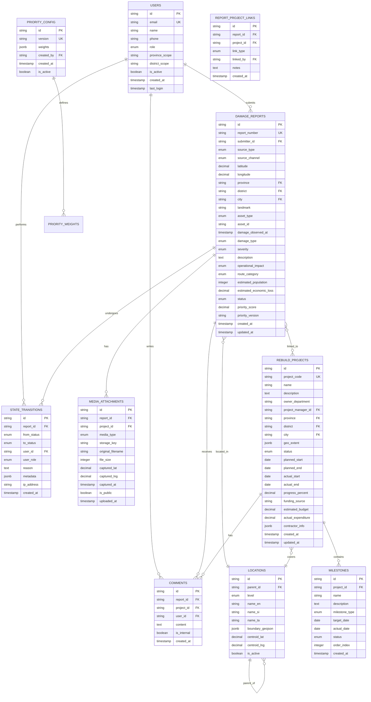
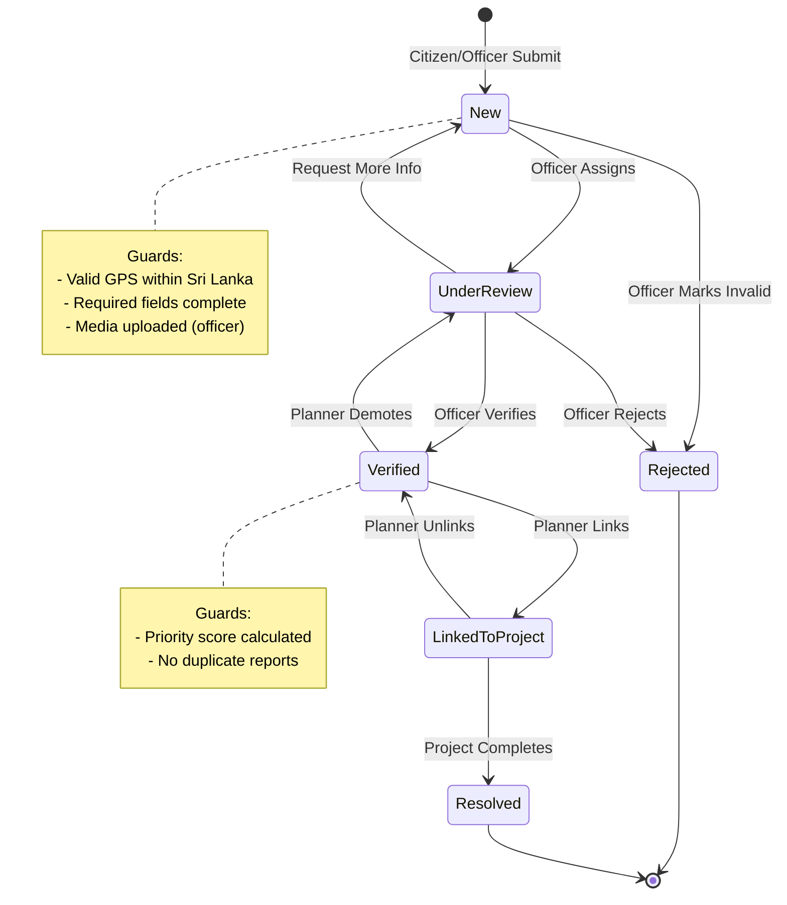

# OpenRebuildLK: Disaster Infrastructure Damage/Rebuild Management Platform

**Date**: 2025-11-30
**Owner**: Ministry of Transport, Highways and Urban Development
**Scope**: Road and rail infrastructure (national level) - Sri Lanka
**Status**: Planning

---

## Overview

OpenRebuildLK is a comprehensive disaster infrastructure damage and rebuild management platform designed to:

1. **Capture** road/rail infrastructure damage via crowdsourcing (citizens) and official channels (engineers, authorities)
2. **Verify** and validate damage reports through a structured workflow
3. **Visualize** damages on a live interactive map canvas
4. **Organize** data by Province → District → City hierarchy
5. **Prioritize** rebuilding using configurable weighted scoring
6. **Track** rebuilding projects with milestones and progress
7. **Provide** public transparency while protecting sensitive internal data

---

## Technical Stack

### Current Foundation (Existing Codebase)

| Layer | Technology | Notes |
|-------|------------|-------|
| Frontend | React 19.0.0 + TypeScript | Vite 6.0.0 for build |
| Backend | Hono 4.8.2 | Cloudflare Workers runtime |
| Deployment | Cloudflare Workers | Edge computing, global CDN |
| Language | TypeScript 5.8.3 | Strict mode enabled |

### Recommended Additions

| Component | Technology | Rationale |
|-----------|------------|-----------|
| **UI Components** | shadcn/ui + Tailwind CSS v4 | Accessible, customizable, tree-shakeable |
| **Maps** | Leaflet + react-leaflet | 1.4M downloads/month, <10k points performance, rich plugins |
| **Database** | Cloudflare D1 (SQLite) | Native Workers integration, serverless |
| **ORM** | Drizzle ORM | Type-safe, edge-compatible, lightweight |
| **Auth** | Cloudflare Access + custom RBAC | Zero-trust, SSO support |
| **Storage** | Cloudflare R2 | S3-compatible, no egress fees |
| **Real-time** | Server-Sent Events (SSE) | Simpler than WebSockets for unidirectional updates |
| **State** | Zustand + TanStack Query | Lightweight client state + server cache |
| **Geo Data** | HDX Sri Lanka boundaries | Official admin levels 1-4 |

---

## User Roles & Permissions

### Role Hierarchy

```
Super Admin
    └── Admin
        └── Ministry Planner / Project Manager
            └── Field Officer / Engineer
                └── Citizen (Authenticated)
                    └── Public User (Anonymous)
                        └── Read-only Stakeholder
```

### Permission Matrix

| Action | Public | Citizen | Field Officer | Planner | Admin |
|--------|--------|---------|---------------|---------|-------|
| View public map | ✓ | ✓ | ✓ | ✓ | ✓ |
| Submit damage report | ✓* | ✓ | ✓ | - | - |
| Track own submissions | ID only | ✓ | ✓ | ✓ | ✓ |
| View internal data | - | - | ✓ | ✓ | ✓ |
| Verify reports | - | - | ✓ | ✓ | ✓ |
| Create projects | - | - | - | ✓ | ✓ |
| Adjust priority weights | - | - | - | ✓ | ✓ |
| Manage users | - | - | - | - | ✓ |
| System configuration | - | - | - | - | ✓ |

*Anonymous submissions with CAPTCHA and rate limiting

---

## Data Model

### Entity Relationship Diagram



### Enumerations

```typescript
// src/types/enums.ts

export enum UserRole {
  PUBLIC = 'public',
  CITIZEN = 'citizen',
  FIELD_OFFICER = 'field_officer',
  PLANNER = 'planner',
  ADMIN = 'admin',
  SUPER_ADMIN = 'super_admin',
  STAKEHOLDER = 'stakeholder'
}

export enum SourceType {
  CITIZEN = 'citizen',
  FIELD_OFFICER = 'field_officer',
  OTHER_AGENCY = 'other_agency'
}

export enum SourceChannel {
  WEB = 'web',
  MOBILE_WEB = 'mobile_web',
  BULK_UPLOAD = 'bulk_upload'
}

export enum AssetType {
  ROAD = 'road',
  BRIDGE = 'bridge',
  CULVERT = 'culvert',
  RAIL_TRACK = 'rail_track',
  RAIL_STATION = 'rail_station',
  LEVEL_CROSSING = 'level_crossing',
  OTHER = 'other'
}

export enum DamageType {
  WASHOUT = 'washout',
  COLLAPSE = 'collapse',
  CRACKING = 'cracking',
  EROSION = 'erosion',
  BLOCKAGE = 'blockage',
  TRACK_MISALIGNMENT = 'track_misalignment',
  LANDSLIDE = 'landslide',
  FLOODING = 'flooding',
  OTHER = 'other'
}

export enum Severity {
  LOW = 1,
  MEDIUM = 2,
  HIGH = 3,
  CRITICAL = 4
}

export enum RoadOperationalImpact {
  FULL_CLOSURE = 'full_closure',
  ONE_LANE_CLOSED = 'one_lane_closed',
  RESTRICTED_ACCESS = 'restricted_access',
  NO_IMPACT = 'no_impact'
}

export enum RailOperationalImpact {
  TRACK_CLOSED = 'track_closed',
  SPEED_RESTRICTION = 'speed_restriction',
  DELAYS_ONLY = 'delays_only',
  NO_IMPACT = 'no_impact'
}

export enum RouteCategory {
  NATIONAL_HIGHWAY = 'national_highway',
  MAIN_RAIL_CORRIDOR = 'main_rail_corridor',
  PROVINCIAL_ROAD = 'provincial_road',
  LOCAL_ROAD = 'local_road'
}

export enum ReportStatus {
  NEW = 'new',
  UNDER_REVIEW = 'under_review',
  VERIFIED = 'verified',
  REJECTED = 'rejected',
  LINKED_TO_PROJECT = 'linked_to_project',
  RESOLVED = 'resolved'
}

export enum ProjectStatus {
  PLANNED = 'planned',
  DESIGN = 'design',
  TENDERING = 'tendering',
  IN_PROGRESS = 'in_progress',
  ON_HOLD = 'on_hold',
  COMPLETED = 'completed',
  CANCELLED = 'cancelled'
}

export enum MilestoneStatus {
  NOT_STARTED = 'not_started',
  ON_TRACK = 'on_track',
  DELAYED = 'delayed',
  COMPLETED = 'completed'
}

export enum MilestoneType {
  PROJECT_START = 'project_start',
  DESIGN_COMPLETE = 'design_complete',
  PERMITS_APPROVED = 'permits_approved',
  CONSTRUCTION_START = 'construction_start',
  HALFWAY_COMPLETE = 'halfway_complete',
  CONSTRUCTION_COMPLETE = 'construction_complete',
  INSPECTION_PASSED = 'inspection_passed',
  PROJECT_DELIVERED = 'project_delivered'
}

export enum LocationLevel {
  COUNTRY = 'country',
  PROVINCE = 'province',
  DISTRICT = 'district',
  CITY = 'city',
  GN_DIVISION = 'gn_division'
}

export enum LinkType {
  PRIMARY = 'primary',
  RELATED = 'related',
  CONTRIBUTING = 'contributing'
}
```

---

## State Machine: Damage Report Workflow



### State Transition Permissions

| From Status | To Status | Allowed Roles |
|-------------|-----------|---------------|
| - | New | citizen, field_officer |
| New | UnderReview | field_officer, planner, admin |
| New | Rejected | field_officer, planner, admin |
| UnderReview | Verified | field_officer, planner, admin |
| UnderReview | Rejected | field_officer, planner, admin |
| UnderReview | New | field_officer (request info) |
| Verified | LinkedToProject | planner, admin |
| Verified | UnderReview | planner, admin |
| LinkedToProject | Resolved | planner, admin |
| LinkedToProject | Verified | planner, admin |

---

## Priority Scoring System

### Default Weight Configuration

| Criterion | Weight | Score Range | Description |
|-----------|--------|-------------|-------------|
| Severity | 0.30 | 1-5 | Physical damage extent |
| Traffic Impact | 0.20 | 1-5 | Operational disruption level |
| Population Affected | 0.15 | 1-5 | Number of people impacted |
| Strategic Importance | 0.15 | 1-5 | National corridor, hospital route |
| Safety Risk | 0.10 | 1-5 | Accident potential |
| Report Age | 0.05 | 1-5 | Days since reported |
| Alternative Routes | 0.05 | 1-5 | Availability of detours |

### Score Calculation

```typescript
// src/services/priority.ts

interface PriorityWeights {
  severity: number;
  trafficImpact: number;
  populationAffected: number;
  strategicImportance: number;
  safetyRisk: number;
  reportAge: number;
  alternativeRoutes: number;
}

interface ReportScores {
  severity: number;        // 1-5
  trafficImpact: number;   // 1-5
  populationAffected: number; // 1-5
  strategicImportance: number; // 1-5
  safetyRisk: number;      // 1-5
  reportAge: number;       // 1-5 (calculated from days)
  alternativeRoutes: number; // 1-5 (5 = no alternatives)
}

export function calculatePriorityScore(
  scores: ReportScores,
  weights: PriorityWeights
): number {
  const total =
    scores.severity * weights.severity +
    scores.trafficImpact * weights.trafficImpact +
    scores.populationAffected * weights.populationAffected +
    scores.strategicImportance * weights.strategicImportance +
    scores.safetyRisk * weights.safetyRisk +
    scores.reportAge * weights.reportAge +
    scores.alternativeRoutes * weights.alternativeRoutes;

  // Normalize to 0-100 scale
  return Math.round((total / 5) * 100);
}
```

---

## API Structure

### Route Organization

```
/api/v1/
├── auth/
│   ├── POST /login
│   ├── POST /register
│   ├── POST /logout
│   ├── POST /forgot-password
│   └── GET  /me
│
├── reports/
│   ├── GET    /                    # List reports (with filters)
│   ├── POST   /                    # Create report
│   ├── GET    /:id                 # Get report details
│   ├── PATCH  /:id                 # Update report
│   ├── DELETE /:id                 # Delete report (admin only)
│   ├── POST   /:id/verify          # Verify report
│   ├── POST   /:id/reject          # Reject report
│   ├── POST   /:id/media           # Upload media
│   ├── GET    /:id/history         # State transition history
│   ├── POST   /:id/comments        # Add comment
│   └── GET    /track/:trackingId   # Public tracking
│
├── projects/
│   ├── GET    /                    # List projects
│   ├── POST   /                    # Create project
│   ├── GET    /:id                 # Get project details
│   ├── PATCH  /:id                 # Update project
│   ├── DELETE /:id                 # Delete project
│   ├── POST   /:id/reports         # Link reports to project
│   ├── DELETE /:id/reports/:reportId # Unlink report
│   ├── GET    /:id/milestones      # List milestones
│   ├── POST   /:id/milestones      # Add milestone
│   └── PATCH  /:id/milestones/:mid # Update milestone
│
├── locations/
│   ├── GET    /provinces           # List provinces
│   ├── GET    /districts/:province # List districts
│   ├── GET    /cities/:district    # List cities
│   ├── GET    /boundaries/:id      # Get GeoJSON boundary
│   └── GET    /reverse-geocode     # Lat/lng to location
│
├── map/
│   ├── GET    /reports             # GeoJSON for map
│   ├── GET    /projects            # Project extents
│   ├── GET    /clusters            # Clustered markers
│   └── GET    /stream              # SSE for real-time updates
│
├── dashboard/
│   ├── GET    /overview            # KPIs and stats
│   ├── GET    /damages-by-region   # Grouped counts
│   ├── GET    /projects-status     # Project progress
│   └── GET    /priority-ranking    # Top N by priority
│
├── admin/
│   ├── GET    /users               # List users
│   ├── POST   /users               # Create user
│   ├── PATCH  /users/:id           # Update user
│   ├── DELETE /users/:id           # Deactivate user
│   ├── GET    /audit-logs          # Audit trail
│   ├── GET    /config/priorities   # Get weight config
│   ├── POST   /config/priorities   # Update weights
│   └── POST   /bulk-upload         # CSV import
│
└── export/
    ├── GET    /reports             # Export reports CSV
    └── GET    /projects            # Export projects CSV
```

---

## Implementation Phases

### Phase 1: Foundation (MVP)

**Goal**: Basic damage reporting and verification workflow

#### 1.1 Project Setup
- [ ] Initialize Tailwind CSS v4
- [ ] Add shadcn/ui components
- [ ] Configure Drizzle ORM with D1
- [ ] Set up R2 for media storage
- [ ] Create base layout components

#### 1.2 Authentication
- [ ] Implement Cloudflare Access integration
- [ ] Create user session management
- [ ] Build login/register UI
- [ ] Implement role-based middleware
- [ ] Add password reset flow

#### 1.3 Location Data
- [ ] Import Sri Lanka administrative boundaries (HDX)
- [ ] Create locations table and seed data
- [ ] Implement reverse geocoding endpoint
- [ ] Build location selector component

#### 1.4 Damage Report Submission
- [ ] Create damage report form (citizen-friendly wizard)
- [ ] Implement GPS location capture
- [ ] Build photo upload with R2 integration
- [ ] Add form validation (Zod schemas)
- [ ] Generate tracking IDs (`RD-YYYY-NNNNNN`)
- [ ] Create submission confirmation page

#### 1.5 Map Visualization
- [ ] Integrate Leaflet with react-leaflet
- [ ] Display Sri Lanka boundaries
- [ ] Show damage report markers
- [ ] Implement marker clustering (Supercluster)
- [ ] Add filter sidebar (status, severity, type)
- [ ] Create popup cards for markers

#### 1.6 Verification Workflow
- [ ] Build verification queue for officers
- [ ] Implement status transitions
- [ ] Create audit log for state changes
- [ ] Add reject with reason flow
- [ ] Build duplicate detection (50m radius)

#### 1.7 Public Portal
- [ ] Create landing page with purpose explanation
- [ ] Build public map (verified reports only)
- [ ] Implement tracking ID lookup
- [ ] Add basic statistics display

**Deliverables**:
- Citizens can submit damage reports with photos
- Field officers can verify/reject reports
- Public map shows verified damages
- Citizens can track their submissions

---

### Phase 2: Project Management

**Goal**: Link damages to rebuilding projects with milestones

#### 2.1 Project CRUD
- [ ] Create project form with linked reports
- [ ] Build project list with filters
- [ ] Implement project detail page
- [ ] Add geo-extent drawing (lines/polygons)

#### 2.2 Milestone Tracking
- [ ] Create milestone templates
- [ ] Build milestone progress UI
- [ ] Implement progress percentage calculation
- [ ] Add overdue milestone alerts

#### 2.3 Priority System
- [ ] Implement priority score calculation
- [ ] Build admin weight configuration UI
- [ ] Add batch recalculation on weight change
- [ ] Create priority ranking views

#### 2.4 Report-Project Linking
- [ ] Multi-select reports for project creation
- [ ] Auto-transition linked reports to new status
- [ ] Handle unlink scenarios
- [ ] Show linked project on report detail

**Deliverables**:
- Planners can create projects from verified damages
- Milestones track project progress
- Priority scores rank rebuilding urgency
- Reports automatically transition when projects complete

---

### Phase 3: Advanced Features

**Goal**: Real-time updates, notifications, and analytics

#### 3.1 Real-Time Map
- [ ] Implement SSE endpoint for updates
- [ ] Add live marker updates
- [ ] Build notification toast system
- [ ] Optimize for 1000+ concurrent viewers

#### 3.2 Notifications
- [ ] Email notification templates
- [ ] Status change notifications
- [ ] Digest emails for stakeholders
- [ ] In-app notification center

#### 3.3 Dashboards
- [ ] Damage overview dashboard
- [ ] Project progress dashboard
- [ ] Regional drill-down views
- [ ] Trend charts (reports over time)

#### 3.4 Export & Reporting
- [ ] CSV export with filters
- [ ] Excel export with formatting
- [ ] Public transparency report generator
- [ ] Print-friendly report views

#### 3.5 Bulk Upload
- [ ] CSV template generation
- [ ] Batch validation with error report
- [ ] Partial success handling
- [ ] Photo matching by filename

**Deliverables**:
- Map updates in real-time
- Users receive status notifications
- Comprehensive analytics dashboards
- Data export in multiple formats

---

### Phase 4: Optimization & Scale

**Goal**: Performance, security, and accessibility

#### 4.1 Performance
- [ ] Implement edge caching
- [ ] Optimize database queries
- [ ] Add image CDN optimization
- [ ] Load test with 10k+ markers

#### 4.2 Security
- [ ] Security audit
- [ ] Rate limiting implementation
- [ ] CAPTCHA for anonymous submissions
- [ ] PII anonymization in exports

#### 4.3 Accessibility
- [ ] WCAG 2.1 AA compliance audit
- [ ] Keyboard navigation
- [ ] Screen reader testing
- [ ] High contrast mode

#### 4.4 Offline Support
- [ ] Service worker for offline map tiles
- [ ] IndexedDB for draft submissions
- [ ] Sync queue for connectivity restoration
- [ ] Conflict resolution UI

---

## File Structure

```
src/
├── react-app/
│   ├── components/
│   │   ├── ui/                    # shadcn/ui components
│   │   ├── layout/
│   │   │   ├── Header.tsx
│   │   │   ├── Sidebar.tsx
│   │   │   └── Footer.tsx
│   │   ├── map/
│   │   │   ├── MapContainer.tsx
│   │   │   ├── DamageMarker.tsx
│   │   │   ├── ProjectExtent.tsx
│   │   │   ├── FilterPanel.tsx
│   │   │   └── ClusterMarker.tsx
│   │   ├── reports/
│   │   │   ├── ReportForm.tsx
│   │   │   ├── ReportCard.tsx
│   │   │   ├── ReportDetail.tsx
│   │   │   ├── VerificationQueue.tsx
│   │   │   └── StatusBadge.tsx
│   │   ├── projects/
│   │   │   ├── ProjectForm.tsx
│   │   │   ├── ProjectCard.tsx
│   │   │   ├── MilestoneTracker.tsx
│   │   │   └── ProgressBar.tsx
│   │   ├── dashboard/
│   │   │   ├── OverviewCards.tsx
│   │   │   ├── RegionChart.tsx
│   │   │   └── TrendChart.tsx
│   │   └── common/
│   │       ├── LocationPicker.tsx
│   │       ├── PhotoUploader.tsx
│   │       └── LoadingSkeleton.tsx
│   ├── pages/
│   │   ├── Home.tsx
│   │   ├── PublicMap.tsx
│   │   ├── SubmitReport.tsx
│   │   ├── TrackReport.tsx
│   │   ├── Dashboard.tsx
│   │   ├── Reports.tsx
│   │   ├── Projects.tsx
│   │   └── Admin.tsx
│   ├── hooks/
│   │   ├── useAuth.ts
│   │   ├── useReports.ts
│   │   ├── useProjects.ts
│   │   ├── useMap.ts
│   │   └── useRealtime.ts
│   ├── stores/
│   │   ├── authStore.ts
│   │   ├── mapStore.ts
│   │   └── filterStore.ts
│   ├── lib/
│   │   ├── api.ts
│   │   ├── validators.ts
│   │   └── utils.ts
│   ├── types/
│   │   ├── enums.ts
│   │   ├── models.ts
│   │   └── api.ts
│   ├── App.tsx
│   ├── main.tsx
│   └── index.css
│
├── worker/
│   ├── routes/
│   │   ├── auth.ts
│   │   ├── reports.ts
│   │   ├── projects.ts
│   │   ├── locations.ts
│   │   ├── map.ts
│   │   ├── dashboard.ts
│   │   ├── admin.ts
│   │   └── export.ts
│   ├── middleware/
│   │   ├── auth.ts
│   │   ├── rbac.ts
│   │   ├── rateLimit.ts
│   │   └── validation.ts
│   ├── services/
│   │   ├── reportService.ts
│   │   ├── projectService.ts
│   │   ├── priorityService.ts
│   │   ├── locationService.ts
│   │   ├── mediaService.ts
│   │   └── notificationService.ts
│   ├── db/
│   │   ├── schema.ts           # Drizzle schema
│   │   ├── migrations/
│   │   └── seed.ts
│   └── index.ts
│
└── shared/
    ├── types.ts
    ├── constants.ts
    └── validation.ts
```

---

## Key Technical Decisions

### 1. Database: Cloudflare D1 (SQLite)

**Rationale**:
- Native Cloudflare Workers integration
- Zero cold start latency
- Automatic replication
- SQL familiarity for team
- Sufficient for expected data volume

**Trade-offs**:
- No native PostGIS (use bounding box queries)
- Limited to 10GB per database
- Max 50 concurrent connections

**Mitigation**:
- Use R-tree index for spatial queries
- Archive old resolved reports yearly
- Connection pooling in Workers

### 2. Maps: Leaflet over Mapbox

**Rationale**:
- Free and open-source
- Lighter bundle size (38KB)
- Excellent plugin ecosystem
- Works on older devices without WebGL
- Performance sufficient for <10k points

**Trade-offs**:
- No 3D terrain or vector tiles
- Less polished than Mapbox

**Mitigation**:
- Use marker clustering for dense areas
- Consider MapLibre GL for future 3D needs

### 3. Real-Time: SSE over WebSockets

**Rationale**:
- Unidirectional (server → client) fits use case
- Simpler implementation
- Auto-reconnect built-in
- Works through proxies/firewalls
- Lower server overhead

**Trade-offs**:
- No client → server messages
- Limited to ~6 connections per domain in older browsers

**Mitigation**:
- Use HTTP/2 for connection multiplexing
- Fallback to polling if SSE unavailable

### 4. State Management: Zustand + TanStack Query

**Rationale**:
- Zustand: 3KB, simple API, devtools support
- TanStack Query: Excellent caching, optimistic updates
- Clear separation: Zustand for UI state, Query for server state

**Trade-offs**:
- Two libraries to learn
- Possible state synchronization issues

**Mitigation**:
- Clear conventions on what goes where
- Query invalidation on Zustand state changes

---

## Critical Questions Requiring Clarification

### Authentication (CRITICAL)

1. **Q**: Will government users authenticate via SSO (e.g., Lanka Government Network)?
   **Assumption**: Cloudflare Access with email OTP for citizens, SSO for government.

2. **Q**: Should anonymous submissions be allowed without any identification?
   **Assumption**: Yes, with CAPTCHA + rate limiting (5/hour/IP).

### Data & Privacy (CRITICAL)

3. **Q**: Must data be stored in Sri Lanka? Any specific compliance requirements?
   **Assumption**: No hard residency requirement; standard data protection practices.

4. **Q**: What information is public vs. internal for damage reports?
   **Assumption**: Public: location, type, severity, status, photos. Internal: reporter contact, notes, budget.

### Workflow (IMPORTANT)

5. **Q**: Can Field Officers be scoped to specific districts only?
   **Assumption**: Yes, optional district-level scope via user profile.

6. **Q**: Do contractors get system access or only internal users?
   **Assumption**: Contractors added as Field Officers with project-specific permissions.

### Technical (IMPORTANT)

7. **Q**: Expected concurrent users during disaster events?
   **Assumption**: 1000 concurrent map viewers, 100 concurrent submitters.

8. **Q**: Multi-language support (Sinhala, Tamil, English)?
   **Assumption**: English MVP; multilingual UI in Phase 4.

---

## Success Metrics

| Metric | Target | Measurement |
|--------|--------|-------------|
| Report submission time | < 3 minutes | Analytics |
| Verification turnaround | < 48 hours | Database |
| Map load time | < 2 seconds | Lighthouse |
| Public portal uptime | 99.9% | Monitoring |
| Mobile usability score | > 90 | Lighthouse |
| User satisfaction | > 4.0/5 | Survey |

---

## Risk Assessment

### High Risk

| Risk | Mitigation |
|------|------------|
| Spam/fake reports from anonymous users | CAPTCHA, rate limiting, device fingerprinting |
| Data loss during disasters | Multi-region replication, offline support |
| Performance under load | Edge caching, clustering, lazy loading |

### Medium Risk

| Risk | Mitigation |
|------|------------|
| GPS accuracy issues | Manual pin adjustment, officer verification |
| Duplicate reports | 50m radius detection, merge workflow |
| Contractor data leakage | Strict RBAC, field-level permissions |

### Low Risk

| Risk | Mitigation |
|------|------------|
| Browser compatibility | Progressive enhancement, polyfills |
| Offline sync conflicts | Last-write-wins with user notification |
| Export abuse | Rate limiting, authentication required |

---

## References

### Internal References
- Existing codebase: `src/react-app/App.tsx`, `src/worker/index.ts`
- Vite config: `vite.config.ts`
- Wrangler config: `wrangler.json`

### External Documentation
- [Cloudflare D1 Docs](https://developers.cloudflare.com/d1/)
- [Cloudflare R2 Docs](https://developers.cloudflare.com/r2/)
- [Drizzle ORM Docs](https://orm.drizzle.team)
- [Leaflet Docs](https://leafletjs.com/)
- [react-leaflet Docs](https://react-leaflet.js.org/)
- [shadcn/ui Docs](https://ui.shadcn.com/)
- [Tailwind CSS Docs](https://tailwindcss.com/)
- [TanStack Query Docs](https://tanstack.com/query/latest)
- [Zustand Docs](https://zustand.docs.pmnd.rs/)

### Sri Lanka GIS Data
- [HDX Sri Lanka Boundaries](https://data.humdata.org/dataset/cod-ab-lka)
- [Survey Department Sri Lanka](https://survey.gov.lk/)
- [Sri Lanka NSDI Geoportal](https://nsdi.gov.lk/geoportal)

### Best Practices
- [OWASP File Upload Cheat Sheet](https://cheatsheetseries.owasp.org/cheatsheets/File_Upload_Cheat_Sheet.html)
- [FEMA Damage Assessment Manual](https://www.fema.gov/sites/default/files/2020-07/Damage_Assessment_Manual_April62016.pdf)
- [W3C Geolocation API](https://www.w3.org/TR/geolocation/)
